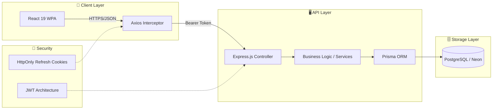

# 🌿 Sparsha: NGO Empowerment Platform

[](https://github.com/seucra/sparsha)
[](https://github.com/seucra/sparsha)

**Sparsha** is a modern, high-performance Progressive Web Application (PWA) designed to empower NGO staff in managing student progress, tracking attendance, and analyzing skill development. Built with a focus on ease of use in the field and data integrity, it provides a unified terminal-style dashboard for real-time impact monitoring.

---

## 🏗️ Architecture Overview

The platform uses a decoupled architecture ensuring high availability and secure data handling.



---

## ✨ Key Features

### 🔐 Enterprise-Grade Security
- **Dual Token Strategy**: Secure authentication using short-lived Access Tokens (in-memory) and long-lived Refresh Tokens (HttpOnly cookies).
- **Role-Based Access Control**: Granular permissions for Admins and NGO staff.

### 📊 Impact Tracking
- **Student Profile Management**: Comprehensive tracking of student demographics and history.
- **Attendance Monitoring**: Easy logging of sessions with real-time status updates.
- **Skill Matrices**: Track development in communication, confidence, and technical skills using advanced radar charts and analytics.
- **Career Pathways**: Manage scholarships, college applications, and career interests.

### 📱 Responsive Design
- **Mobile Optimized**: Optimized for both high-density desktop dashboards and touch-friendly mobile views.
- **Modern UI**: Teal-themed professional interface using Tailwind CSS 4.

---

## 🛠️ Technology Stack

| Layer | Technologies |
| :--- | :--- |
| **Frontend** | React 19, TypeScript, Vite, Tailwind CSS 4, TanStack Query |
| **State & Logic** | Zustand, Axios, React Router 7 |
| **Visualization** | Recharts, Lucide Icons |
| **Backend** | Node.js (v22+ recommended), Express.js |
| **Database** | PostgreSQL (Neon), Prisma ORM |
| **PWA** | Web Manifests, Service Workers |

---

## 🚀 Getting Started

### 1. Prerequisites
- **Node.js**: v22.x or higher
- **PostgreSQL**: A running instance or Neon account
- **npm**: v10.x or higher

### 2. Backend Setup
```bash
cd backend
npm install
cp .env.example .env
# Edit .env and add your DATABASE_URL and JWT_ACCESS_SECRET
npm run dev
```
*The backend will run on `http://localhost:5000`.*

### 3. Frontend Setup
```bash
cd frontend
npm install
cp .env.example .env
# Ensure VITE_API_BASE_URL=http://localhost:5000
npm run dev
```
*The frontend will run on `http://localhost:5173`.*

---

## 📄 Environment Configuration

### Backend (`/backend/.env`)
| Variable | Description | Default |
| :--- | :--- | :--- |
| `DATABASE_URL` | PostgreSQL connection string | REQUIRED |
| `JWT_ACCESS_SECRET` | Secret key for access tokens | REQUIRED |
| `JWT_REFRESH_SECRET`| Secret key for refresh tokens | REQUIRED |
| `PORT` | Backend server port | `5000` |
| `CLIENT_URL` | Frontend URL for CORS | `http://localhost:3000` |

### Frontend (`/frontend/.env`)
| Variable | Description | Default |
| :--- | :--- | :--- |
| `VITE_API_BASE_URL` | Base URL of the backend API | `http://localhost:5000` |

---

## 🏁 Roadmap & Status

- [x] **Phase 1**: Core Auth & Student Discovery
- [x] **Phase 2**: Attendance & Skill Logging
- [/] **Phase 3**: Advanced Analytics & Career Tracking (In Progress)
- [ ] **Phase 4**: PWA Support (Manifest, Service Workers, Offline Sync)
- [ ] **Phase 5**: Document Uploads & Field Mode

---

## 🤝 Contributing & Support

This project is currently in a **Working Phase**. For support or contributions, please contact the development team at Sparsha NGO.

---
*© 2026 Sparsha NGO Operations Platform. Built with transparency and passion.*
